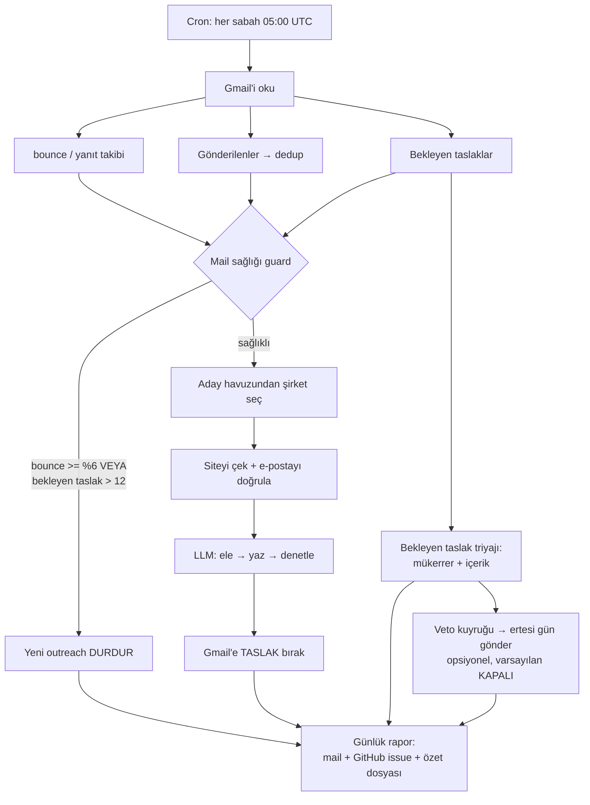

# outreachos — Mimari ve "Kendin Nasıl Yaparsın" Rehberi

Bu doküman, günlük çalışan bir **iş arama / soğuk outreach otomasyonunun** mimarisini ve neden
böyle tasarlandığını anlatır. Amaç: okuyan birinin sistemi baştan kurabilmesi ve —daha
önemlisi— **bizim düştüğümüz çukurlara düşmemesi**.

Sistem her sabah tek başına çalışır: şirket keşfeder, eler, e-postayı doğrular, kişiselleştirilmiş
bir mail taslağı yazar, uydurma iddia içerip içermediğini denetler, Gmail'e taslak bırakır ve
sana günlük rapor yollar. Bilgisayarın kapalı olsa da çalışır (GitHub Actions cron).

> **Bu bir "mail bombardımanı botu" değil.** Aşağıdaki güvenlik değişmezleri (§6) sistemin
> merkezinde; onları çıkarırsan elinizde kalan şey spam üretecidir.

---

## 1. Tasarımı Şekillendiren Kısıtlar

Her mimari karar bu kısıtlardan doğdu. Kendi sisteminizi kurarken kısıtlarınız farklıysa
kararlar da değişir.

| Kısıt | Sonucu |
|---|---|
| **Bilgisayar kapalıyken de çalışmalı** | Cron = GitHub Actions (ücretsiz), yerel zamanlayıcı değil |
| **Maliyet ~sıfır olmalı** | Mekanik iş (arama, HTML çekme, dedup) saf Python; LLM sadece "uygun mu + ne yazsın" kararında |
| **Gmail itibarı yanmamalı** | Günlük sert tavan, bounce ölçümü, devre kesici (§5) |
| **Yalan söylememeli** | Üç ayrı LLM adımı: yaz → bağımsız denetle → deterministik sayı kontrolü (§4) |
| **Kişisel veri public repoya sızmamalı** | İki repo: kod public, veri private (§2) |
| **Aynı firmaya iki kez gitmemeli** | Üç katmanlı dedup, tek doğruluk kaynağı Gmail (§3.5) |

---

## 2. İki Repo Ayrımı

```
outreachos        (PUBLIC)   → kod, karar motoru, dashboard
outreachos-data   (PRIVATE)  → profil, CV, state, günlük loglar, cron workflow
```

**Neden:** kod paylaşılabilir olmalı ama profil/CV/kiminle iletişime geçildiği paylaşılamaz.
Cron her run'da public repoyu private repo içine klonlar (`_code/`), kararları oradan okur.

> ⚠️ Public repo'nun `.gitignore`'una private repo klasörünü **mutlaka** ekleyin. Yoksa bir
> `git add .` kişisel verinizi public'e taşır. (Biz bunu geç fark ettik.)

---

## 3. Veri Akışı



### 3.1 Keşif
Serper.dev üzerinden Google araması (anahtar yoksa/kota bitince DuckDuckGo'ya düşer) ile YC/accelerator dizinleri,
"biz kimiz" sayfaları, iş ilanı sayfaları taranır. Çıktı: aday domain havuzu (~5800 domain).
Havuz ayrı bir scriptle (`refresh_pool.py`) periyodik beslenir; günlük run havuzdan tüketir.

### 3.2 Önceliklendirme
Alfabetik sıra 5800 adayda her gün aynı isimlere takılmak demek. Bunun yerine:
`(1) şu an işe alıyor mu → (2) ekip küçük mü → (3) domain`. Küçük ekiplerde `info@` adresini
genelde kurucu okur; junior birinin etkisi de büyük olur.

### 3.3 E-posta doğrulama (bounce'un ilk savunma hattı)
İki koşul **birden** sağlanmalı:
1. Adres şirketin **kendi sayfasının HTML'inde birebir geçiyor** olmalı,
2. Domainin **MX kaydı** olmalı (DNS-over-HTTPS ile kontrol).

**Asla tahmin yok.** `info@<domain>` uydurmak bounce üretir; bounce itibar yakar.
Ayrıca kişiye özel adresler (`ahmet@`) kullanılmaz — sadece genel kutular (`info@`,
`careers@`, `hello@`). Bu hem GDPR açısından hem nezaket açısından doğru.

> Bu kontrol bile yetmiyor: şirketin sitesinde yayınladığı ama **artık kimsenin okumadığı**
> bir kutu MX'i geçer ama bounce eder. Onu ancak bounce geldikten sonra öğrenebiliyoruz →
> §5'teki geri besleme döngüsü bu yüzden var.

### 3.4 Paralellik ve zaman bütçesi
Darboğaz HTTP beklemesi olduğu için `ThreadPoolExecutor` (6 worker) yeterli. Daha fazlası
hedef sitelere karşı saldırgan olur ve rate-limit yer.

**Zaman bütçesi kritik:** ilk sürümde run 30 dakikada kesildi ve **o ana kadarki bütün iş
kayboldu**. Artık script kendi bütçesini (45 dk) izler, dolunca döngüyü durdurur ve
o ana kadarki sonuçları **yine de kaydeder**. Workflow tavanı (60 dk) sadece emniyet.

### 3.5 Dedup — üç katman, tek doğruluk kaynağı
Aynı firmaya iki kez başvurmak utanç vericidir. Üç katman:

1. `state.json` → iletişime geçilenler geçmişi
2. **Gmail Gönderilenler taraması** → elle/dışarıdan gönderdiklerin de sayılır
3. **Bekleyen taslakların alıcı domainleri** → aynı firmaya ikinci taslak açılmaz

Kritik nokta: doğruluk kaynağı `state.json` **değil, Gmail'in kendisi**. State bozulsa/silinse
bile Gönderilenler taraması gerçeği geri getirir. Dedup **domain düzeyinde** yapılır
(`iris@x.com` ile `hello@x.com` aynı firmadır).

---

## 4. LLM Katmanı — Üç Ayrı Çağrı (en önemli tasarım kararı)

Tek çağrıda "değerlendir + yaz + kendini denetle" demek **çalışmıyor**. Model kendi
çıktısını güvenilir şekilde denetlemiyor. Bu yüzden üç ayrı sorumluluk:

| Adım | Model | Görev |
|---|---|---|
| `judge` | Haiku (ucuz, çok çağrılır) | "Bu şirket makul bir hedef mi?" |
| `draft` | Sonnet | Maili yaz (sadece elemeden geçenler için) |
| `verify` | Sonnet | "Bu metindeki her iddianın profilde karşılığı var mı?" — **bağımsız göz** |

Artı **deterministik sayı denetimi**: metindeki her sayı profilde geçiyor mu diye regex ile
bakılır. LLM metriği gözden kaçırabiliyor; bu kaçırmıyor.

`verify` reddederse taslak **bir kez** düzeltme şansıyla yeniden yazdırılır; yine kirliyse
şirket atlanır. **Şüphedeyken göndermemek, göndermekten iyidir.**

### Gerçek vakalar (bu yüzden bu kadar paranoyayız)
- Model, profilde hiç olmayan *"fizyoterapi platformunda ürün geliştirdim"* cümlesini kurdu
  ve mail gerçek bir şirkete gitti. → `verify` adımı bu yüzden ayrıldı.
- *"150K+ aylık etkin kullanıcı"* uydurdu. → deterministik sayı denetimi bu yüzden var.
- Profildeki `ortalama 0.56, pik 0.81` metriğini *"0.81 IoU"* diye başlığa taşıdı (çarpıtma).
- **En sinsisi:** profilde olmayan teknoloji/uyumluluk iddiaları — *"real-time IoT sensor
  data"*, *"tsvector index / JSONB agregatör"*, *"GDPR-level data handling"*. Bunlar
  ilk `verify` sürümünden **geçti**; elle denetimde yakalandı (örneklenen 14 taslağın 3'ü,
  ~%20). Artık `verify` bu kategorileri açıkça reddediyor.

**Ders:** LLM denetimi bir kalite katmanıdır, garanti değil. Gerçekten önemliyse insan
onayını mimariden çıkarmayın.

---

## 5. Teslim Edilebilirlik (Deliverability) Guard'ı

Soğuk mail atan her sistemin er ya da geç çarptığı duvar: **bounce oranı yükselir, mailler
spam'e düşer, artık iyi yazılmış mailler bile ulaşmaz.**

### Ölçüm
- **Payda:** son 30 günde gerçekten *Gönderilenler*'e düşen farklı outreach alıcısı
  (taslak sayısı **değil** — bounce ancak gönderilen maile gelir).
- **Pay:** aynı pencerede `mailer-daemon`'dan gelen **kalıcı (hard)** bounce alan adresler.
- Geçici (soft: kota dolu, 4.x.x, greylist) bounce'lar ayrı sayılır — onlar itibar sinyali değil.
- Ücretsiz posta sağlayıcıları (kendi adresin, kişisel yazışma) paydadan düşer.

### Eşikler ve devre kesici
| Durum | Oran | Davranış |
|---|---|---|
| 🟢 İYİ | < %3 | normal |
| 🟡 İZLEME | %3–6 | rapora uyarı + trend; otomatik gönderim tavanı yarıya iner |
| 🔴 KRİTİK | ≥ %6 | **yeni outreach durur** (bounce takibi, ATS listesi, rapor devam eder) |

Ek fren: **bekleyen taslak > 12 ise yeni taslak üretilmez.** Sebebi ilk bakışta belli değil:
biriken taslak, sistemin ürettiği ama insanın onaylamadığı iştir. Birikmeye devam ederse
(a) boşuna LLM parası yanar, (b) bir gün hepsi birden gönderilirse ani hacim sıçraması
spam sinyali olur. Önce backlog boşalsın, sonra üretim devam etsin.

**Küçük örnek koruması:** 12 gönderimden az veri varken oran hesaplanmaz (1 bounce / 3
gönderim = %33 gibi yanlış alarmlar sistemi haksız yere durdurmasın).

**Fail-open:** Gmail'e erişilemiyorsa durum "ölçülemedi" olur ve **fren devreye girmez** —
ölçememek, kötü olduğu anlamına gelmez.

### Geri besleme döngüsü
Bounce alan adres `email_dead` işaretlenir ve o domain bir daha **hiç** denenmez. Sistem
zamanla kendi hedef listesini temizler.

> **SPF/DKIM/DMARC neden kontrol edilmiyor?** Gönderen `@gmail.com`; bu kayıtlar Google'ın
> ve her zaman hizalı. Kontrol etmek gürültüden ibaret olurdu. Kendi domaininizden
> gönderiyorsanız **bu üçü sizin için kritiktir** — mutlaka kurun.
>
> **SMTP/RCPT probe neden yok?** 25. port CI ortamlarında kapalı, ayrıca probe'un kendisi
> itibara zarar verip bloklanmaya yol açabiliyor.

---

## 6. Güvenlik Değişmezleri

Bunlar "şimdilik böyle" değil, **mimarinin taşıyıcı kolonları**:

1. **Şirketlere otomatik mail YOK.** Outreach varsayılan olarak taslakta kalır; gönderme
   kararı insana aittir. (§7'deki opsiyonel kat bunu gevşetir — varsayılan kapalıdır ve
   kendi zinciri vardır.)
2. **Kişiye özel adres tahmin edilmez.** Sadece sitede birebir geçen genel kutular.
3. **Rapor maili yalnızca kullanıcının kendi adresine.** Hedef adres, bağlı hesabın kendi
   adresiyle eşleşmezse gönderim **reddedilir** — yanlışlıkla dışarı mail atmaya karşı kilit.
4. **CAPTCHA otomatik geçilmez**, LinkedIn'de otomatik mesaj atılmaz (hazır arama linki
   verilir, mesajı insan atar). Hesap banlanmasın diye.
5. **Şüphedeyken durmak varsayılandır** (fail-safe), doğrulama yapılamadıysa "temiz" sayılmaz.

---

## 7. Opsiyonel: Veto Pencereli Otomatik Gönderim

Backlog birikince ortaya çıkan gerçek problem: guard yeni üretimi durdurur, insan da
taslakları göndermeye vakit bulamaz → **kilitlenme**. Çözüm, insanı döngüden çıkarmadan
akışı sürdürmek:

```
audit ✅GÜVENLİ  →  1 gün veto penceresi  →  bounce guard izni  →  MX yeniden kontrol  →  gönder
```

- **Veto = taslağı Gmail'den silmek.** Kuyruktaki taslak artık "canlı" değilse gönderilmez.
  Yeni bir arayüz gerekmez; kullanıcı zaten Gmail'de.
- **MX yeniden kontrol edilir**, çünkü adres kuyrukta beklerken ölmüş olabilir — bounce'un
  doğrudan hedef alınması budur.
- **Günlük sert tavan** (varsayılan 5) hacim sıçramasını engeller.
- **Varsayılan KAPALI** (`AUTO_SEND=0`). Kapalıyken kuyruk yine hesaplanır ve raporda
  "gönderilebilirdi" diye gösterilir — önce güven oluşur, sonra açılır.

Her halka bağımsız iptal edebilir: içerik yeniden denetimde kirlenirse, MX kaybolursa,
bounce kritiğe çıkarsa veya kullanıcı silerse → gönderilmez.

---

## 8. Bekleyen Taslak Triyajı

Her run, Gmail'deki bekleyen taslakları denetleyip dört karardan biriyle etiketler:

| | Anlamı |
|---|---|
| ✅ **GÖNDER** | Mükerrer değil + içerik doğrulandı |
| 🔁 **SİL** | Bu firmaya Gönderilenler'de zaten mail var |
| ⚠️ **DÜZELT** | İçerik denetimi desteklenmeyen iddia buldu |
| 👀 **ELLE BAK** | Otomatik doğrulanamadı — güvenli varsayılmaz |
| ⏳ **SIRADA** | Run'ın LLM kotası doldu, sonraki run'da |

Maliyet kontrolü: karar, taslak gövdesinin **hash'iyle cache'lenir** (gövde değişmediyse
tekrar LLM çağrılmaz) ve run başına yeni doğrulama sayısı sınırlıdır. Mükerrer tespiti
LLM gerektirmez, o yüzden bedavadır ve **önce** çalışır.

---

## 9. Bildirim: İki Kanal (biri her zaman ulaşır)

1. **Gerçek mail** — günlük rapor kullanıcının kendi adresine (`gmail.send`).
2. **Yedek: GitHub issue** — workflow `run_summary.md`'yi issue olarak açar, GitHub sahibine
   bildirim maili atar.

Neden iki kanal: (1) token'da `gmail.send` izni yoksa sessizce atlanır; (2) her koşulda çalışır.
**Tek bildirim kanalına güvenmeyin** — sessizce çalışmayan bir otomasyon, çalışmayan
otomasyondan kötüdür.

---

## 10. Maliyet

| Kalem | Aylık |
|---|---|
| GitHub Actions | 0 ₺ (public repo / ücretsiz kota) |
| Serper.dev (arama) | 0 ₺ (2.500 sorgu hediye; ~400 sorgu/ay tüketimle aylarca yeter, sonrası kredi bazlı ücretli; bitince DuckDuckGo) |
| Anthropic API | birkaç dolar (Haiku eleme + Sonnet yazma/denetleme) |

Kritik seçim: eleme adımı **ucuz modelle** (çok çağrılır), yazma/denetleme **güçlü modelle**
(az çağrılır, kalite kritik). Tersi hem pahalı hem kötü olurdu.

---

## 11. Kendi Sisteminizi Kurma Sırası

Bu sıra tesadüfi değil — her adım bir öncekini doğrular. **Sırayı atlamayın.**

1. **Profilinizi yazın** (`state.json`): deneyim, projeler, metrikler, sertifikalar.
   Bu, LLM'in **tek gerçek kaynağıdır**. Buraya yazmadığınız hiçbir şey mailde geçemez.
2. **Karar kurallarını yazın** — hangi rol/sektör elenecek, hangi lokasyon kabul.
   Kod olarak, deterministik. LLM'e sormayın.
3. **E-posta doğrulamayı kurun** (site-içi birebir eşleşme + MX). LLM'den önce bu.
4. **Dry-run yapın:** hiçbir şey göndermeden 10 aday üretin, çıktıyı **elle okuyun**.
5. **Taslak (draft) modunda çalıştırın** — haftalarca. Sistemin ne yazdığını görün.
6. **Denetim katmanını ekleyin** (verify + sayı kontrolü). 4-5. adımda gördüğünüz
   hatalar bu katmanın gereksinimlerini yazacak.
7. **Ölçmeye başlayın** (bounce, yanıt). Ölçmediğiniz şeyi koruyamazsınız.
8. **Frenleri ekleyin** (§5). Ancak ölçüm varsa anlamlı.
9. **Otomatik gönderimi en son düşünün** — ve düşünürken §4'teki %20 hata oranını hatırlayın.

### Sık yapılan hatalar
- ❌ Önce otomatik göndermeye başlamak, sonra kaliteyi düşünmek
- ❌ E-posta adresini tahmin etmek (`info@` uydurmak)
- ❌ Tek LLM çağrısına "yaz ve kendini denetle" demek
- ❌ Bounce'u ölçmemek
- ❌ Kişisel veriyi public repoda tutmak
- ❌ Zaman aşımında ara sonuçları kaydetmemek
- ❌ Hacmi maksimize etmek (günde 30 mail + %13 bounce = spam kutusu)

---

## 12. Dosya Haritası

**Public repo (kod):**
```
src/pipeline.py     karar motoru — rol filtresi, eleme kuralları (anahtarsız çalışır)
src/app.py          yerel dashboard (stdlib HTTP sunucu)
src/db.py           SQLite şema + durum normalizasyonu
src/migrate.py      CSV/JSON → DB (idempotent)
```

**Private repo (veri + cron):**
```
scripts/discover.py       ana akış: keşif → doğrulama → taslak → guard → rapor
scripts/drafting.py       judge / draft / verify + deterministik sayı denetimi
scripts/deliverability.py bounce ölçümü + eşikler + devre kesici
scripts/audit_drafts.py   bekleyen taslak triyajı (mükerrer + içerik)
scripts/autosend.py       veto pencereli gönderim (varsayılan KAPALI)
scripts/report.py         günlük rapor + ATS digest + LinkedIn hedefleri
.github/workflows/daily.yml   cron tanımı ve tüm ayar knob'ları
```

Guard modüllerinin hepsi **saf çekirdek + kendi kendini test eden** yapıda:
```bash
python scripts/deliverability.py   # → self-test: OK
python scripts/audit_drafts.py
python scripts/autosend.py
```
Ağ gerektirmezler; mantığı bozarsanız testler bağırır.

---

## 13. Etik Not

Bu sistem **iş arayan bir kişinin kendi başvurularını** ölçeklendirir; pazarlama spam'i
üretmek için değildir. Ayrımı koruyan şeyler: küçük günlük hacim, gerçek kişiselleştirme
(her mail o şirketin ne yaptığına dair somut bir detay içerir), yalnızca genel iletişim
kutuları, ve yanıt/bounce'a saygı (bir kez bounce eden adrese bir daha yazılmaz).

Bu sınırları gevşetirseniz teknik olarak "çalışan" ama etik olarak spam olan bir şey
elde edersiniz. Sistemin değeri hız değil, **isabet**.
