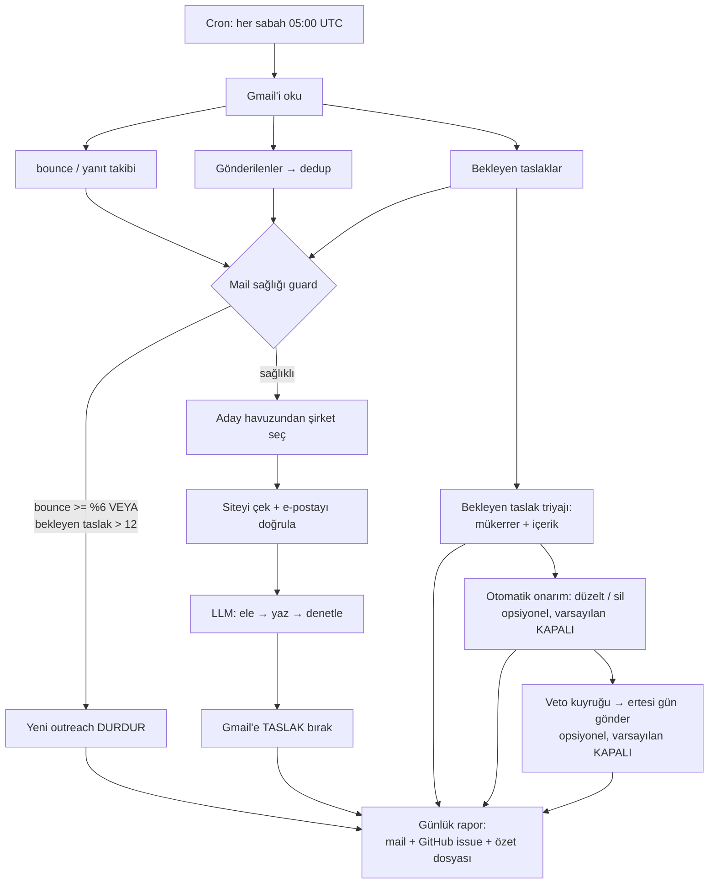

# outreachos — Mimari ve "Kendin Nasıl Yaparsın" Rehberi

Bu doküman, günlük çalışan bir **iş arama / soğuk outreach otomasyonunun** mimarisini ve neden
böyle tasarlandığını anlatır. Amaç: okuyan birinin sistemi baştan kurabilmesi ve —daha
önemlisi— **bizim düştüğümüz çukurlara düşmemesi**.

Sistem her sabah tek başına çalışır: şirket keşfeder, eler, e-postayı doğrular, kişiselleştirilmiş
bir mail taslağı yazar, uydurma iddia içerip içermediğini denetler, Gmail'e taslak bırakır ve
sana günlük rapor yollar. Bilgisayarın kapalı olsa da çalışır (GitHub Actions cron).

> **Bu bir "mail bombardımanı botu" değil.** Aşağıdaki güvenlik değişmezleri (§6) sistemin
> merkezinde; onları çıkarırsan elinizde kalan şey spam üretecidir.

---

## 1. Tasarımı Şekillendiren Kısıtlar

Her mimari karar bu kısıtlardan doğdu. Kendi sisteminizi kurarken kısıtlarınız farklıysa
kararlar da değişir.

| Kısıt | Sonucu |
|---|---|
| **Bilgisayar kapalıyken de çalışmalı** | Cron = GitHub Actions (ücretsiz), yerel zamanlayıcı değil |
| **Maliyet ~sıfır olmalı** | Mekanik iş (arama, HTML çekme, dedup) saf Python; LLM sadece "uygun mu + ne yazsın" kararında |
| **Gmail itibarı yanmamalı** | Günlük sert tavan, bounce ölçümü, devre kesici (§5) |
| **Yalan söylememeli** | Üç ayrı LLM adımı: yaz → bağımsız denetle → deterministik sayı kontrolü (§4) |
| **Kişisel veri public repoya sızmamalı** | İki repo: kod public, veri private (§2) |
| **Aynı firmaya iki kez gitmemeli** | Üç katmanlı dedup, tek doğruluk kaynağı Gmail (§3.5) |

---

## 2. İki Repo Ayrımı

```
outreachos        (PUBLIC)   → kodun TAMAMI: karar motoru, dashboard, günlük motor (scripts/)
outreachos-data   (PRIVATE)  → yalnızca veri: profil, CV, state, günlük loglar, cron workflow
```

**Neden:** kod paylaşılabilir olmalı, profil/CV/kiminle iletişime geçildiği paylaşılamaz.
Ayrım ancak **hiçbir kod private repoda kalmazsa** işe yarar: aksi halde kodu göstermek
için veriyi de göstermek gerekir. Bu yüzden `scripts/` public repodadır.

**Kod veriyi nasıl bulur — tek seam:** `OUTREACHOS_DATA_DIR` ortam değişkeni.

```
OUTREACHOS_DATA_DIR tanımlıysa  → veri kökü orasıdır   (iki-repo kurulumu, cron)
tanımlı değilse                 → kod reposunun kökü   (tek klasör, yerel/self-host)
```

`scripts/discover.py` ve `src/db.py` **aynı** değişkeni okur; bu yüzden karar motoru ile
günlük motor her zaman aynı `state.json` / `tracker.db` / `outreach_log.csv` dosyalarını
görür. (Eskiden `state.json` klonun köküne kopyalanıyordu — o hack kalktı.)

Cron akışı: private repo checkout edilir → public repo `_code/`e klonlanır →
`OUTREACHOS_DATA_DIR=$GITHUB_WORKSPACE` ile `_code/scripts/discover.py` çalışır →
sonuçlar private repoya geri commit'lenir.

> ⚠️ Public repo'nun `.gitignore`'una private repo klasörünü **mutlaka** ekleyin. Yoksa bir
> `git add .` kişisel verinizi public'e taşır. (Biz bunu geç fark ettik.)

---

## 3. Veri Akışı


```mermaid
flowchart TD
    A[Cron: her sabah 05:00 UTC] --> B[Gmail'i oku]
    B --> B1[bounce / yanıt takibi]
    B --> B2[Gönderilenler → dedup]
    B --> B3[Bekleyen taslaklar]
    B1 & B2 & B3 --> G{Mail sağlığı guard}
    G -->|bounce >= %6 VEYA<br/>bekleyen taslak > 12| STOP[Yeni outreach DURDUR]
    G -->|sağlıklı| D[Aday havuzundan şirket seç]
    D --> E[Siteyi çek + e-postayı doğrula]
    E --> F[LLM: ele → yaz → denetle]
    F --> H[Gmail'e TASLAK bırak]
    B3 --> I[Bekleyen taslak triyajı:<br/>mükerrer + içerik]
    I --> K[Otomatik onarım: düzelt / sil<br/>opsiyonel, varsayılan KAPALI]
    K --> J[Veto kuyruğu → ertesi gün gönder<br/>opsiyonel, varsayılan KAPALI]
    STOP & H & I & K & J --> R[Günlük rapor:<br/>mail + GitHub issue + özet dosyası]
```

### 3.1 Keşif
Serper.dev üzerinden Google araması (anahtar yoksa/kota bitince DuckDuckGo'ya düşer) ile YC/accelerator dizinleri,
"biz kimiz" sayfaları, iş ilanı sayfaları taranır. Çıktı: aday domain havuzu (~7200 domain).
Havuz ayrı bir scriptle (`refresh_pool.py`) periyodik beslenir; günlük run havuzdan tüketir.

Dizinler iki listede durur. `SEED_DIRECTORIES` erken aşama ve Türkiye dizinleridir.
`SCALEUP_DIRECTORIES` büyüme aşaması kaynaklarıdır: fonlanmış ve işe alan şirket listesi
(TopStartups) ile Seri A ve Seri B ağırlıklı VC portföyleri (Avrupa ve Türkiye). İkinci
listeden gelen aday `olcek` işareti alır. Bir dizin listeye girmeden önce `harvest_links` ile
yerelde denenir; JavaScript ile çizilen ve düz HTML'de şirket linki vermeyen sayfa eklenmez.

### 3.2 Önceliklendirme
Alfabetik sıra 7200 adayda her gün aynı isimlere takılmak demek. Bunun yerine:
`(1) şu an işe alıyor mu → (2) ekip hedef bantta mı → (3) domain` (`candidate_priority`).
Hedef bant varsayılan olarak 20 ile 300 kişi arasıdır (`SCALEUP_BAND`): büyüyen şirketler öne
alınır, sonra bandın altındaki ekipler, sonra ekibi bilinmeyenler, en sonda çok büyük şirketler.
Kimse elenmez, yalnızca sıra değişir. Çok büyük şirketlerin ilanları ATS özetinden gelir.

`olcek` işaretli adayın ekip büyüklüğü çoğu zaman bilinmez (VC portföy sayfası bunu vermez).
Böyle bir aday "işe alıyor" sayılır ve bandın içinde, domaininden türetilen sabit bir sıraya
yerleştirilir. Böylece ekibi bilinen YC şirketleriyle karışık sıralanır; ne hepsinin önüne
geçer ne de listenin sonunda bekler.

Arama sorguları haftanın gününe göre döner (`QUERIES_BY_WEEKDAY`): yurt dışı ağırlıklı, Türkiye
haftada iki gün. Başvuranın aradığı rol state'teki `profile.targeting` alanında durur.

### 3.3 E-posta doğrulama (bounce'un ilk savunma hattı)
İki koşul **birden** sağlanmalı:
1. Adres şirketin **kendi sayfasının HTML'inde birebir geçiyor** olmalı,
2. Domainin **MX kaydı** olmalı (DNS-over-HTTPS ile kontrol).

**Asla tahmin yok.** `info@<domain>` uydurmak bounce üretir; bounce itibar yakar.
**Hangi adrese yazılır (`choose_address`).** Sitede birden çok adres varsa sıra şudur:
1. Yanında adı soyadı ve kurucu, mühendislik ya da işe alım unvanı yazan kişi (`ada@`,
   sayfada "Ada Lovelace, Co-Founder & CTO" ile birlikte geçiyorsa). Adresin çevresindeki
   metne bakılır; düz kelime değil unvan aranır.
2. Başvuru kutusu (`careers@`, `jobs@`, `people@`, `talent@`).
3. Diğer genel kutular (`info@`, `hello@`, `contact@`).

Destek, satış, basın, hukuk gibi rol kutularına ve yanında adı ya da unvanı yazmayan
adreslere yazılmaz (`customer.experience@` ve `accommodations@` gibi kutular kişi adresinden
başka türlü ayırt edilemiyor); yanında satış ya da pazarlama rolü geçen kişi de atlanır.

**Hangi sayfalara bakılır.** Ana sayfa, iletişim, hakkında ve kariyer yolları; yazılabilir bir
kutu çıkmadıysa yasal sayfalar (`/privacy`, `/privacy-policy`, `/imprint`, `/impressum`).
Arama, yazılabilir bir adres bulunana kadar sürer: ilk sayfada yalnızca `support@` görüp
durmaz. İletişim sayfası form olan şirketlerin genel kutusu çoğu zaman yalnızca yasal sayfada
yazar; oradaki kişi adresi (veri sorumlusu) seçilmez. 144 gerçek sitede bu iki değişiklik
adresi bulunan aday sayısını 29'dan 44'e çıkardı. Yalnızca genel kutu bulunduysa `/team` ve
`/about` sayfalarına da bir kez bakılır. Kişi adresi de aynı iki
koşula tabidir: şirketin kendi sitesinde yayınlanmış olmalı ve tahmin edilmemelidir. Firma
başına tek mail kuralı değişmez (mükerrer kapısı domain düzeyindedir). `NAMED_CONTACT=0`
eski davranışı (yalnızca genel kutu) geri getirir.

**Adres yoksa ilan panosu (`jobboard.py`).** Yazılabilir adresi
çıkmayan adayın okunan sayfalarında Greenhouse, Lever, Ashby ya da Workable panosuna giden
bağlantı aranır; sayfada birden çok pano varsa adı alan adına benzeyen seçilir. Aynı pano
bir run'da bir kez işlenir, eleme ya da sektör filtresinden geçmeyen panonun şirketi 14 gün
yeniden sorulmaz (state: `pano_ret`). Varsa açık ilanlar panonun herkese açık ilan API'sinden okunur ve rol
filtresinden geçirilir: kıdem ve sert eleme kuralları aynen geçerlidir, ayrıca başlığın
`role_categories_include` içindeki bir kategoriye oturması gerekir (panonun tamamı okunduğu
için "açıkça elenmedi" yetmez). Uyan ilanı olan şirket `judge` ve sektör filtresinden de
geçerse ilanları "sen başvur" listesine girer: şirket başına en fazla 2 ilan, run başına en
fazla `ATS_ADAY_LIMIT` (8) yeni ilan. Konum filtre değil tercihtir (`jobboard.yer_onceligi`):
sıralamada önce uzaktan ya da Türkiye ve Avrupa ilanları, sonra konumu belirsiz olanlar,
en sonda diğerleri (ör. ABD ofisi ya da ABD ile sınırlı uzaktan ilan) gelir; aynı konum
önceliğinde giriş seviyesi olan öne geçer. En sondaki grup run tavanının en fazla yarısını
kullanabilir (`jobboard.tavana_sigan`). Defterde bekleyen şirket yeniden elemeye sokulmaz,
ilanı tazelenir. İlan rapora yalnızca ilk görüldüğü gün girer,
açık kaldığı sürece `takip.md`'de durur. Ölçüm: öncelik sırasındaki ilk 120 adayın 37'sinde
adres, 23'ünde pano vardı; 10'unun panosunda role uyan ilan açıktı (16 ilan).

> Bu kontrol bile yetmiyor: şirketin sitesinde yayınladığı ama **artık kimsenin okumadığı**
> bir kutu MX'i geçer ama bounce eder. Onu ancak bounce geldikten sonra öğrenebiliyoruz →
> §5'teki geri besleme döngüsü bu yüzden var.

### 3.4 Paralellik ve zaman bütçesi
Darboğaz HTTP beklemesi olduğu için `ThreadPoolExecutor` (6 worker) yeterli. Daha fazlası
hedef sitelere karşı saldırgan olur ve rate-limit yer.

**Zaman bütçesi kritik:** ilk sürümde run 30 dakikada kesildi ve **o ana kadarki bütün iş
kayboldu**. Artık script kendi bütçesini (45 dk) izler, dolunca döngüyü durdurur ve
o ana kadarki sonuçları **yine de kaydeder**. Workflow tavanı (60 dk) sadece emniyet.

### 3.5 Dedup — üç katman, tek doğruluk kaynağı
Aynı firmaya iki kez başvurmak utanç vericidir. Üç katman:

1. `state.json` → iletişime geçilenler geçmişi
2. **Gmail Gönderilenler taraması** → elle/dışarıdan gönderdiklerin de sayılır
3. **Bekleyen taslakların alıcı domainleri** → aynı firmaya ikinci taslak açılmaz

Kritik nokta: doğruluk kaynağı `state.json` **değil, Gmail'in kendisi**. State bozulsa/silinse
bile Gönderilenler taraması gerçeği geri getirir. Dedup **domain düzeyinde** yapılır
(`iris@x.com` ile `hello@x.com` aynı firmadır).

---

## 4. LLM Katmanı — Üç Ayrı Çağrı (en önemli tasarım kararı)

Tek çağrıda "değerlendir + yaz + kendini denetle" demek **çalışmıyor**. Model kendi
çıktısını güvenilir şekilde denetlemiyor. Bu yüzden üç ayrı sorumluluk:

| Adım | Model | Görev |
|---|---|---|
| `judge` | Haiku (ucuz, çok çağrılır) | "Bu şirket makul bir hedef mi?" |
| `draft` | Sonnet | Maili yaz (sadece elemeden geçenler için) |
| `verify` | Sonnet | "Bu metindeki her iddianın profilde karşılığı var mı?" — **bağımsız göz** |

Artı **deterministik sayı denetimi** (`numeric.py`): metindeki her sayı profilde ya da
modelin okuduğu site metninde geçiyor mu diye bakılır. LLM metriği gözden kaçırabiliyor; bu
kaçırmıyor. Site metni şirketin kendi sayıları içindir ("sitenizdeki 100,000 kullanıcı").
Karşılaştırma yazıya değil değere bakar: `100,000`, `100.000`, `100 bin` ve `100K` aynı
sayıdır; `150` ile `150K+`, `4.9` ile `9` farklıdır (eki atıp rakamı karşılaştırmak sitedeki
"150 employees" ile "150K+ kullanıcı" uydurmasını geçiriyordu). Ayraçlı gövde sayısı
kaynaktaki yıla eşlenmez (`2.026 kullanıcı` profildeki 2026 ile geçmez); beyaz liste (1 ile 5,
yıllar) yalnızca eksiz düz sayıya uygulanır. Başvuranın kendi iddialarını profile bağlayan kat `verify`
olmaya devam eder. Site sayesinde geçen sayılar kayda `sayi_izni` olarak yazılır: bekleyen
taslak denetimi ve onarım siteyi görmez, bu izin olmadan aynı sayıyı ertesi gün uydurma
sayardı.

**Eleme ölçütü (`JUDGE_SYSTEM`).** Geniş tutulur: yazılım geliştiren ya da ürününü bir
uygulama üzerinden sunan her şirket hedeftir (tüketici ve sosyal uygulamalar, fintech, kart
ürünleri dahil). Savunma ve siber güvenlik dışlaması şirketin ana ürününe bakar; güvenlik
genel amaçlı bir ürünün kullanım alanlarından biriyse şirket elenmez. Çağrı `temperature=0`
ile yapılır: sınırdaki şirket bir run'da geçip ertesi gün elenmesin.

`verify` reddederse taslak **bir kez** düzeltme şansıyla yeniden yazdırılır; yine kirliyse
şirket atlanır. **Şüphedeyken göndermemek, göndermekten iyidir.**

**Modele giden site metni (`drafting.page_text`).** Script, stil, svg ve yorum blokları
atılır, meta açıklama başa alınır. Yalnızca etiketler silinirken 142 gerçek sitenin 107'sinde
modele giden ilk 3000 karakter font tanımı ve izleme koduydu: `judge` şirketi "metin bozuk"
diye düşürüyor, `draft` şirketin ne yaptığını görmeden yazıyordu.

**Eleme dökümü (`report.skip_breakdown`).** Rapor, günlük özet ve kuru deneme logu elenen
adayları sebep grubuna göre sayar (sitede adres yok, yalnızca rol kutusu, daha önce yazıldı,
eleme adımı ...). Toplam sayı tek başına hangi kapının aday düşürdüğünü göstermiyordu.

**Role göre CV linki.** Profilde `cv_links` (anahtar → link) varsa `draft` şirketin işine en
uygun CV'nin anahtarını seçer; linki gövdenin sonuna kod ekler (`attach_cv`). Linki model
yazmaz: uzun bir adresi kopyalarken bozabilir. Anahtar geçersizse profildeki ilk CV kullanılır.
Run logundaki `cv:<anahtar>` eki hangi CV'nin seçildiğini gösterir. Gövdeye ayrıca
`profile.portfolio` (kişisel site) satırı eklenir (`drafting.sign`). CV satırındaki PDF maile
ek olarak da girer (`discover._draft_raw`): önce linkten indirilir, açılmazsa veri reposundaki
`cv/` kopyası kullanılır. Ek ve site satırı olmayan eski taslaklar gönderimden hemen önce
güncellenir; güncellenemeyen taslak o gün gitmez, kuyrukta kalır.

### Gerçek vakalar (bu yüzden bu kadar paranoyayız)
- Model, profilde hiç olmayan *"fizyoterapi platformunda ürün geliştirdim"* cümlesini kurdu
  ve mail gerçek bir şirkete gitti. → `verify` adımı bu yüzden ayrıldı.
- *"150K+ aylık etkin kullanıcı"* uydurdu. → deterministik sayı denetimi bu yüzden var.
- Profildeki `ortalama 0.56, pik 0.81` metriğini *"0.81 IoU"* diye başlığa taşıdı (çarpıtma).
- **En sinsisi:** profilde olmayan teknoloji/uyumluluk iddiaları — *"real-time IoT sensor
  data"*, *"tsvector index / JSONB agregatör"*, *"GDPR-level data handling"*. Bunlar
  ilk `verify` sürümünden **geçti**; elle denetimde yakalandı (örneklenen 14 taslağın 3'ü,
  ~%20). Artık `verify` bu kategorileri açıkça reddediyor.

**Ders:** LLM denetimi bir kalite katmanıdır, garanti değil. Gerçekten önemliyse insan
onayını mimariden çıkarmayın.

---

## 5. Teslim Edilebilirlik (Deliverability) Guard'ı

Soğuk mail atan her sistemin er ya da geç çarptığı duvar: **bounce oranı yükselir, mailler
spam'e düşer, artık iyi yazılmış mailler bile ulaşmaz.**

### Ölçüm
- **Payda:** son 30 günde gerçekten *Gönderilenler*'e düşen farklı outreach alıcısı
  (taslak sayısı **değil** — bounce ancak gönderilen maile gelir).
- **Pay:** aynı pencerede `mailer-daemon`'dan gelen **kalıcı (hard)** bounce alan adresler.
- Geçici (soft: kota dolu, 4.x.x, greylist) bounce'lar ayrı sayılır — onlar itibar sinyali değil.
- Ücretsiz posta sağlayıcıları (kendi adresin, kişisel yazışma) paydadan düşer.

### Eşikler ve devre kesici
| Durum | Oran | Davranış |
|---|---|---|
| 🟢 İYİ | < %3 | normal |
| 🟡 İZLEME | %3–6 | rapora uyarı + trend; otomatik gönderim tavanı yarıya iner |
| 🔴 KRİTİK | ≥ %6 | **yeni outreach durur** (bounce takibi, ATS listesi, rapor devam eder) |

Ek fren: **bekleyen taslak > 12 ise yeni taslak üretilmez.** Sebebi ilk bakışta belli değil:
biriken taslak, sistemin ürettiği ama insanın onaylamadığı iştir. Birikmeye devam ederse
(a) boşuna LLM parası yanar, (b) bir gün hepsi birden gönderilirse ani hacim sıçraması
spam sinyali olur. Önce backlog boşalsın, sonra üretim devam etsin.

**Küçük örnek koruması:** 12 gönderimden az veri varken oran hesaplanmaz (1 bounce / 3
gönderim = %33 gibi yanlış alarmlar sistemi haksız yere durdurmasın).

**Fail-open:** Gmail'e erişilemiyorsa durum "ölçülemedi" olur ve **fren devreye girmez** —
ölçememek, kötü olduğu anlamına gelmez.

### Geri besleme döngüsü
Bounce alan adres `email_dead` işaretlenir ve o domain bir daha **hiç** denenmez. Sistem
zamanla kendi hedef listesini temizler.

> **SPF/DKIM/DMARC neden kontrol edilmiyor?** Gönderen `@gmail.com`; bu kayıtlar Google'ın
> ve her zaman hizalı. Kontrol etmek gürültüden ibaret olurdu. Kendi domaininizden
> gönderiyorsanız **bu üçü sizin için kritiktir** — mutlaka kurun.
>
> **SMTP/RCPT probe neden yok?** 25. port CI ortamlarında kapalı, ayrıca probe'un kendisi
> itibara zarar verip bloklanmaya yol açabiliyor.

---

## 6. Güvenlik Değişmezleri

Bunlar "şimdilik böyle" değil, **mimarinin taşıyıcı kolonları**:

1. **Şirketlere gönderim varsayılan olarak KAPALI.** Outreach taslakta kalır; gönderme
   kararı insana aittir. §7'deki opsiyonel kat bunu bilinçli bir tercihle gevşetir:
   kendi zinciri vardır (denetim, veto penceresi, bounce guard, MX, günlük tavan) ve
   denetimden geçmemiş hiçbir taslak gönderilmez. Aynı şekilde motor varsayılan olarak
   hiçbir taslağı silmez; silme yalnızca §8'deki `AUTO_REPAIR_DELETE` ile açılır.
2. **Kişiye özel adres tahmin edilmez.** Sadece sitede birebir geçen genel kutular.
3. **Rapor maili yalnızca kullanıcının kendi adresine.** Hedef adres, bağlı hesabın kendi
   adresiyle eşleşmezse gönderim **reddedilir** — yanlışlıkla dışarı mail atmaya karşı kilit.
4. **CAPTCHA otomatik geçilmez**, LinkedIn'de otomatik mesaj atılmaz (hazır arama linki
   verilir, mesajı insan atar). Hesap banlanmasın diye.
5. **Şüphedeyken durmak varsayılandır** (fail-safe), doğrulama yapılamadıysa "temiz" sayılmaz.

---

## 7. Opsiyonel: Veto Pencereli Otomatik Gönderim

Backlog birikince ortaya çıkan gerçek problem: guard yeni üretimi durdurur, insan da
taslakları göndermeye vakit bulamaz → **kilitlenme**. Çözüm, insanı döngüden çıkarmadan
akışı sürdürmek:

```
audit ✅GÜVENLİ  →  1 gün veto penceresi  →  bounce guard izni  →  MX yeniden kontrol  →  gönder
```

- **Veto = taslağı Gmail'den silmek.** Kuyruktaki taslak artık "canlı" değilse gönderilmez.
  Yeni bir arayüz gerekmez; kullanıcı zaten Gmail'de.
- **MX yeniden kontrol edilir**, çünkü adres kuyrukta beklerken ölmüş olabilir — bounce'un
  doğrudan hedef alınması budur.
- **Günlük sert tavan** (varsayılan 5) hacim sıçramasını engeller.
- **Varsayılan KAPALI** (`AUTO_SEND=0`). Kapalıyken kuyruk yine hesaplanır ve raporda
  "gönderilebilirdi" diye gösterilir — önce güven oluşur, sonra açılır.

Her halka bağımsız iptal edebilir: içerik yeniden denetimde kirlenirse, MX kaybolursa,
bounce kritiğe çıkarsa veya kullanıcı silerse → gönderilmez.

---

## 8. Bekleyen Taslak Triyajı

Her run, Gmail'deki bekleyen taslakları denetleyip dört karardan biriyle etiketler:

| | Anlamı |
|---|---|
| ✅ **TEMİZ** | Mükerrer değil + içerik doğrulandı; veto kuyruğuna girer |
| 🔁 **MÜKERRER** | Bu firmaya zaten mail gitmiş (Gönderilenler ya da kalıcı kayıt); onarım siler |
| ⚠️ **İÇERİK HATASI** | İçerik denetimi desteklenmeyen iddia buldu; onarım yeniden yazar |
| 👀 **KARARSIZ** | Doğrulama karar veremedi. Güvenli varsayılmaz; sonraki run yeniden denetler, yine kararsızsa içerik hatası sayılıp onarıma gider (kullanıcıya iş kalmaz) |
| ⏳ **SIRADA** | Run'ın LLM kotası doldu, sonraki run'da |

Maliyet kontrolü: karar, **gövde + profil + denetim kurallarının sürümü** hash'iyle
cache'lenir (üçü de değişmediyse tekrar LLM çağrılmaz) ve run başına yeni doğrulama sayısı
sınırlıdır (`AUDIT_MAX_VERIFY`). Kural sürümü anahtarda olduğu için denetim prompt'u
değişince eski kararlar kendiliğinden geçersiz olur; yoksa eski kurala göre "temiz" çıkmış
taslak sonsuza kadar temiz kalırdı. Gönderim kuyruğundaki taslaklar önce denetlenir.
Mükerrer tespiti LLM gerektirmez, o yüzden bedavadır ve **önce** çalışır.

### 8.1 Opsiyonel: otomatik onarım (`AUTO_REPAIR`, varsayılan KAPALI)

Triyaj tek başına bir **kilit** üretir: ⚠️ DÜZELT damgalı taslakları onaran yoksa birikir,
bekleyen sayısı guard eşiğini geçer ve yeni üretim durur. Onarım katı bu halkayı kapatır:

```
⚠️ DÜZELT  →  onar (LLM, en fazla 2 tur)  →  sayı kontrolü + bağımsız verify  →  ✅  →  veto kuyruğu
```

- **Onarım da denetimden geçer.** Onaran model ile denetleyen model ayrı çağrılardır;
  onarılmış metin §4'teki aynı kapıdan geçmeden ✅ sayılmaz.
- **Maili yarıdan fazla kısaltan onarım reddedilir.** "Şüpheli her cümleyi sil" kolay
  yoldur ama geriye gönderilmeye değmeyen bir mail bırakır.
- **Altyapı hatası "onarılamadı" sayılmaz.** API zaman aşımı yüzünden bir taslak silinmesin.
- **Sarmalanmış linkler açılır.** Gmail arayüzünde elle düzenlenen taslakta linkler
  `google.com/url?q=...` sarmalayıcısına dönüşebilir; bu LLM gerektirmeyen bir düzeltmedir.
- **Taslak yerinde güncellenir** (raw MIME, `text/plain`, id değişmez): veto kuyruğu ve
  denetim cache'i id üzerinden çalıştığı için yeni taslak açmak ikisini de bozardı.
- `REPAIR_MAX` run başına LLM maliyetini sınırlar; onarılamayan taslak gövde hash'iyle
  kaydedilir, gövde değişmedikçe aynı taslağa tekrar LLM harcanmaz.

**Silme ayrı bir anahtardır** (`AUTO_REPAIR_DELETE`, varsayılan KAPALI) çünkü geri
alınamaz: iki turda onarılamayan taslak ve Gönderilenler'de karşılığı olan mükerrer
**kalıcı** silinir. Kapalıyken bunlar raporda "onarılamadı" diye listelenir ve insan karar
verir. Silinen onarılamayan taslağın firması, taslak Gönderilenler taramasının ulaştığı
tarih aralığındaysa aday havuzuna geri döner (yeni bir taslak şansı); mükerrerin firması
dönmez (zaten mail gitmiş).

**Son kapı (mükerrer gönderim):** `send_draft` çağrılmadan hemen önce
`autosend.duplicate_check` alıcıyı sırayla aynı run'da gönderilenlere, kalıcı kayda
(`autosend_sent` ve gönderim kanallı `companies_already_contacted` kayıtları), bugünkü
Gönderilenler taramasına ve Gmail'in kendisine (`in:sent to:<domain>`, tarih penceresi
yok) sorar. Anahtar kurumsal adreste domain, ücretsiz postada adresin kendisidir. Denetimin
🔁 kararı Gönderilenler'in son 200 mesajına dayandığı için tek başına yetmez. Yakalanan
taslak kuyruktan düşer ve kaydına `sent_confirmed` yazılır (sonraki denetim onu 🔁 sayar);
Gmail cevap vermezse taslak gönderilmez, kuyrukta kalır.

**Sahiplik filtresi:** denetim, onarım, silme ve otomatik gönderim yalnızca motorun kendi
açtığı taslaklara dokunur (`companies_already_contacted` içinde `draft_id`'si kayıtlı olanlar).
Bekleyen-taslak freni de yalnızca bunları sayar; kayıtsız taslak denetim kotası harcamaz.
Taslaklar klasöründe kullanıcının elle yazdığı mailler de durur; filtre olmasa yazışılmış
bir firmaya hazırlanan yanıt taslağı "mükerrer" diye silinir, yeni bir firmaya yazılan yarım
taslak da ✅ çıkarsa ertesi gün gönderilirdi. Kaydı olmayan taslak sayısı raporda görünür;
gönderim kuyruğuna önceden girmiş kayıtsız taslak gönderilmeden kuyruktan düşürülür.

**Hayalet veto koruması:** veto "taslak Gmail'de yok" demektir, ama taslak listesi eksik
okunduysa (hız limiti, ağ hatası) okunamayan taslak "silinmiş" görünür. Bu yüzden tarama
eksikse kuyruktaki eksik id'ler Gmail'e tek tek sorulur ve yalnızca **404** dönen veto
sayılır. Gmail okuma çağrıları üstel beklemeyle yeniden denenir (429, 5xx, ağ hatası).

---

## 9. Bildirim: İki Kanal (biri her zaman ulaşır)

1. **Gerçek mail** — günlük rapor kullanıcının kendi adresine (`gmail.send`).
2. **Yedek: GitHub issue** — workflow `run_summary.md`'yi issue olarak açar, GitHub sahibine
   bildirim maili atar.

Neden iki kanal: (1) token'da `gmail.send` izni yoksa sessizce atlanır; (2) her koşulda çalışır.
**Tek bildirim kanalına güvenmeyin** — sessizce çalışmayan bir otomasyon, çalışmayan
otomasyondan kötüdür.

### 9.1 Günlük takip panosu (`takip.md`)

Raporun başındaki "Bugün ilgilenmen gerekenler" bloğu ve veri reposundaki `takip.md`
kayıtlardan türetilir. Elle işaretlenen bir alan yoktur; kullanıcıya soru sorulmaz.

- **Yanıt okuma (`tracking.py`).** İki kaynak: (a) bizim açtığımız konuşmalara gelen her mail
  (konuşma kimlikleri Gönderilenler taramasından toplanır, gönderen başka domainden yazsa da
  yakalanır), (b) yazıştığımız adres ve domainlerden gelen, yeni konuşma açan mailler
  (5'erli `from:(a OR b ...)` sorguları; tanıtım, sosyal ve forum kategorileri hariç).
  İlk çalıştırmada pencere 120 gün, sonraki run'larda 30 gün.
- **Sınıflama.** Görüşme daveti, ret, otomatik yanıt, insan yanıtı, gürültü. Kural tabanlıdır,
  LLM çağrısı yoktur: konu ve özetteki kalıplar ile `List-Unsubscribe`, `Precedence`,
  `Auto-Submitted` başlıkları. Bizim konuşmamıza gelen mail gürültü sayılmaz. Gürültü (bülten,
  müşteri hizmeti maili) yanıt olarak kaydedilmez; eski sürümün "yanıt" diye yazdığı gürültü
  kayıtları ilk çalıştırmada temizlenir.
- **Elle gönderilmiş kayıtlar.** Gönderilenler taramasının eklediği kayıt (`sent_scan`) başvuru
  olmayabilir (destek kaydı, kişisel yazışma). Her biri için bir kez `in:sent to:<hedef>`
  sorulur ve yazılan mailin konusuna bakılır; karar kayda `basvuru` olarak yazılır. Başvuru
  olmayan kayıt panoya girmez, gelen yanıtı da sayılmaz. Tek istisna görüşme davetidir: davet
  gelen kayıt başvuru kabul edilir.
- **Firma durumu (`board.py`).** görüşme, yanıt geldi, otomatik yanıt, ret, gönderildi (yanıt
  yok), taslak bekliyor, bounce, kapandı. Durum her run'da kayıttan yeniden hesaplanır.
- **Görüşme hazırlığı (`prep.py`).** Son 14 günde görüşme daveti gelen her firma için bir kez
  hazırlık notu yazılır: şirket ne yapıyor, profilden uyan noktalar, sorulabilecekler,
  adayın sorabilecekleri. Girdi firmanın ana sayfası, profil ve gelen yanıtın özetidir.
  Bot kimliğini reddeden site için sayfa tarayıcı başlıklarıyla bir kez daha istenir; site
  bulut sunucusuna hiç açılmıyorsa kaynak, arama dizinindeki kendi sayfa özetleri olur
  (`site:<domain>` sorgusu).
  Sitede ve profilde geçmeyen bir sayı içeren not atılır (taslaklardaki `numeric_check`).
  Not kayda `hazirlik` olarak yazılır, o günün raporuna ve `takip.md`'ye girer. Dört
  başarısız denemeden sonra (site açılmıyor, not denetimden dönüyor) bırakılır.
- **Cevaplanma.** Yanıttan sonra o hedefe Gönderilenler'de mail varsa "cevapladın" sayılır ve
  iş listeden düşer.
- **Kayıp taslak.** Taslağı Gmail'de olmayan ve gönderildiği bilinmeyen kayıt için Gmail'e
  `in:sent to:<hedef>` sorulur (run başına en fazla 60 kayıt). Mail gittiyse `sent_confirmed`
  yazılır (mükerrer kapısı da bunu görür), gitmediyse `gonderim_soruldu` yazılır ve bir daha
  sorulmaz.
- **İlan defteri (`ats_ledger`).** ATS özetindeki ve adayların kendi panolarından gelen (§3.3)
  ilanlar günden güne taşınır; ilk kez görülen
  ilan raporda `[YENİ]` etiketi alır. Konu satırında başvuru geçen mailler ayrı bir deftere
  (`applications_seen`) yazılır; firmanın adı bir başvuru mailinde kelime olarak geçiyorsa
  ilan kapanır ve listeden düşer (`board.firma_deseni`: "Juni" "Junior"da eşleşmez, pano
  adının sonundaki sayı atılır, "Open" gibi tek kelimelik genel adlar kapatmaz). Panodan
  gelen ilanın anahtarı şehirsiz başlıktır. 30 gün görülmeyen ilan defterden silinir.

Sınırlar: sınıflama kalıp tabanlıdır; hiçbir kalıba uymayan mail "yanıt" sayılıp kullanıcıya
gösterilir (kaçırmaktansa fazladan göstermek tercih edildi). Başvuru eşlemesi firma adının
mailin göndereninde ya da konusunda geçmesine dayanır.

---

## 10. Maliyet

| Kalem | Aylık |
|---|---|
| GitHub Actions | 0 ₺ (public repo / ücretsiz kota) |
| Serper.dev (arama) | 0 ₺ (2.500 sorgu hediye; ~400 sorgu/ay tüketimle aylarca yeter, sonrası kredi bazlı ücretli; bitince DuckDuckGo) |
| Anthropic API | birkaç dolar (Haiku eleme + Sonnet yazma/denetleme) |

Kritik seçim: eleme adımı **ucuz modelle** (çok çağrılır), yazma/denetleme **güçlü modelle**
(az çağrılır, kalite kritik). Tersi hem pahalı hem kötü olurdu.

---

## 11. Kendi Sisteminizi Kurma Sırası

Bu sıra tesadüfi değil — her adım bir öncekini doğrular. **Sırayı atlamayın.**

1. **Profilinizi yazın** (`state.json`): deneyim, projeler, metrikler, sertifikalar.
   Bu, LLM'in **tek gerçek kaynağıdır**. Buraya yazmadığınız hiçbir şey mailde geçemez.
2. **Karar kurallarını yazın** — hangi rol/sektör elenecek, hangi lokasyon kabul.
   Kod olarak, deterministik. LLM'e sormayın.
3. **E-posta doğrulamayı kurun** (site-içi birebir eşleşme + MX). LLM'den önce bu.
4. **Dry-run yapın:** hiçbir şey göndermeden 10 aday üretin, çıktıyı **elle okuyun**.
5. **Taslak (draft) modunda çalıştırın** — haftalarca. Sistemin ne yazdığını görün.
6. **Denetim katmanını ekleyin** (verify + sayı kontrolü). 4-5. adımda gördüğünüz
   hatalar bu katmanın gereksinimlerini yazacak.
7. **Ölçmeye başlayın** (bounce, yanıt). Ölçmediğiniz şeyi koruyamazsınız.
8. **Frenleri ekleyin** (§5). Ancak ölçüm varsa anlamlı.
9. **Otomatik gönderimi en son düşünün** — ve düşünürken §4'teki %20 hata oranını hatırlayın.

### Sık yapılan hatalar
- ❌ Önce otomatik göndermeye başlamak, sonra kaliteyi düşünmek
- ❌ E-posta adresini tahmin etmek (`info@` uydurmak)
- ❌ Tek LLM çağrısına "yaz ve kendini denetle" demek
- ❌ Bounce'u ölçmemek
- ❌ Kişisel veriyi public repoda tutmak
- ❌ Zaman aşımında ara sonuçları kaydetmemek
- ❌ Hacmi maksimize etmek (günde 30 mail + %13 bounce = spam kutusu)

---

## 12. Dosya Haritası

**Public repo (kodun tamamı):**
```
src/pipeline.py     karar motoru — rol filtresi, eleme kuralları (anahtarsız çalışır)
src/app.py          yerel dashboard (stdlib HTTP sunucu)
src/db.py           SQLite şema + durum normalizasyonu + veri kökü seam'i
src/migrate.py      CSV/JSON → DB (idempotent)

scripts/discover.py       ana akış: keşif → doğrulama → taslak → guard → rapor
scripts/drafting.py       judge / draft / verify / repair (LLM adımları)
scripts/numeric.py        deterministik sayı denetimi (değer tabanlı eşleme)
scripts/jobboard.py       şirketin ilan panosu: pano bulma, ilan API'leri, konum tercihi
scripts/deliverability.py bounce ölçümü + eşikler + devre kesici
scripts/audit_drafts.py   bekleyen taslak triyajı (mükerrer + içerik)
scripts/repair.py         otomatik onarım + silme kararları (varsayılan KAPALI)
scripts/autosend.py       veto pencereli gönderim (varsayılan KAPALI)
scripts/report.py         günlük rapor + ATS digest + LinkedIn hedefleri
scripts/tracking.py       gelen yanıtı okur ve sınıflar (görüşme, ret, otomatik, gürültü)
scripts/board.py          takip panosu: firma durumu, bugünün işleri, ilan defteri
scripts/prep.py           görüşme daveti gelince hazırlık notu (site + profil, uydurma denetimli)
scripts/refresh_pool.py   aday havuzunu tazeler (elle çalıştırılır)
scripts/get_gmail_token.py Gmail refresh token → GitHub secret

.github/workflows/daily.example.yml   cron şablonu (fork edenler kopyalar)
```

**Private repo (yalnızca veri + cron):**
```
state.json            profil + kurallar + iletişim geçmişi (LLM'in tek gerçek kaynağı)
cv/                   taslak yazarken bağlam olarak kullanılan özgeçmişler
outreach_log.csv      insan-okunur append-only log
tracker.db            dashboard verisi
gunluk_ozet/          her run'ın günlük özeti
takip.md              takip panosu (motor her run'da baştan yazar)
candidate_pool.json   keşif havuzu
.github/workflows/daily.yml   cron tanımı ve tüm ayar knob'ları
```

Burada **kod yoktur** — bu repo hiç kimseyle paylaşılmaz, paylaşılması da gerekmez.

Guard modüllerinin hepsi **saf çekirdek + kendi kendini test eden** yapıda:
```bash
python scripts/deliverability.py   # → self-test: OK
python scripts/audit_drafts.py
python scripts/autosend.py
python scripts/tracking.py
python scripts/board.py
python scripts/prep.py
```
Ağ gerektirmezler; mantığı bozarsanız testler bağırır.

---

## 13. Etik Not

Bu sistem **iş arayan bir kişinin kendi başvurularını** ölçeklendirir; pazarlama spam'i
üretmek için değildir. Ayrımı koruyan şeyler: küçük günlük hacim, gerçek kişiselleştirme
(her mail o şirketin ne yaptığına dair somut bir detay içerir), yalnızca genel iletişim
kutuları, ve yanıt/bounce'a saygı (bir kez bounce eden adrese bir daha yazılmaz).

Bu sınırları gevşetirseniz teknik olarak "çalışan" ama etik olarak spam olan bir şey
elde edersiniz. Sistemin değeri hız değil, **isabet**.
